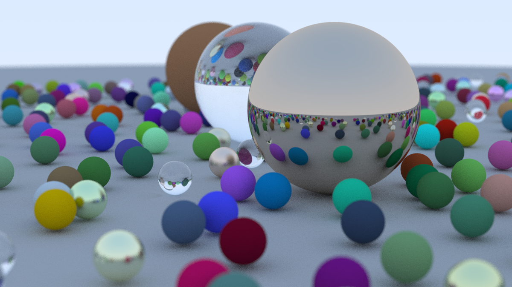

# Toy-Ray-Tracing
> 参照 [Ray Tracing in One Weekend](https://raytracing.github.io/books/RayTracingInOneWeekend.html)

基于c++实现的简单光线追踪，实践起来比冯氏光照模型那一套有意思多了，效果也很漂亮。但渲染是真的慢，下面这个图渲染了俩小时。

## Project setup
使用make指令编译运行（linux环境），生成图片以ppm格式存放在output目录下。
```
git clone https://github.com/DinoMax00/Toy-Ray-Tracing.git

cd ToyRayTracing

make
```

make指令通过PPM参数指定生成图片名称。
```
make PPM=Name
```
